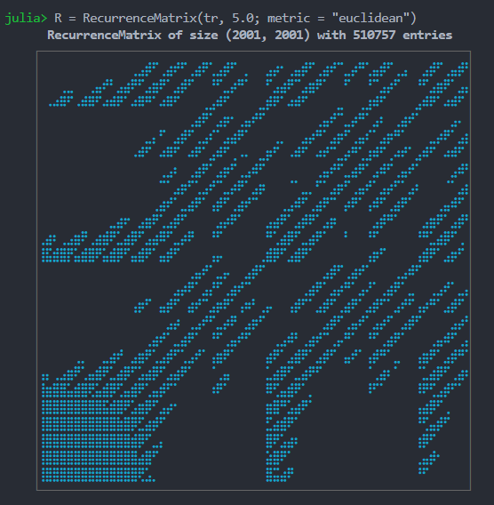

# Recurrence Plots
## Recurrence Matrices

A [Recurrence plot](https://en.wikipedia.org/wiki/Recurrence_plot) (which refers to the plot of a matrix) is a way to quantify *recurrences* that occur in a trajectory. A recurrence happens when a trajectory visits the same neighborhood on the phase space that it was at some previous time.

The central structure used in these recurrences is the (cross-) recurrence matrix:
```math
R[i, j] = \begin{cases}
1 \quad \text{if}\quad d(x[i], y[j]) \le \varepsilon\\
0 \quad \text{else}
\end{cases}
```
where $d(x[i], y[j])$ stands for the _distance_ between trajectory $x$ at point $i$ and trajectory $y$ at point $j$. Both $x, y$ can be single timeseries, full trajectories or embedded timeseries (which are also trajectories).

If $x\equiv y$ then $R$ is called recurrence matrix, otherwise it is called cross-recurrence matrix. There is also the joint-recurrence variant, see below.
With `RecurrenceAnalysis` you can use the following functions to access these matrices
```@docs
RecurrenceMatrix
CrossRecurrenceMatrix
JointRecurrenceMatrix
```

## Simple Recurrence Plots
The recurrence matrices are internally stored as sparse matrices with boolean values. Typically in the literature one does not "see" the matrices themselves but instead a plot of them (hence "Recurrence Plots"). By default, when a Recurrence Matrix is created we "show" a mini plot of it which is a text-based scatterplot.

Here is an example recurrence plot/matrix of a full trajectory of the Roessler system:
```@example MAIN
using DynamicalSystems
ro = Systems.roessler(ones(3), a=0.15, b=0.20, c=10.0)
N = 2000; Δt = 0.05
tr = trajectory(ro, N*Δt; Δt, Ttr = 10.0)

R = RecurrenceMatrix(tr, 5.0; metric = "euclidean")
recurrenceplot(R; ascii = true)
```
```@example MAIN
typeof(R)
```
```@example MAIN
summary(R)
```


The above simple plotting functionality is possible through the package [`UnicodePlots`](https://github.com/Evizero/UnicodePlots.jl). The following function creates the plot:
```@docs
recurrenceplot
```


Here is the same plot but using Unicode Braille characters
```@example MAIN
recurrenceplot(R; ascii = false)
```

As you can see, the Unicode based plotting doesn't display nicely everywhere. It does display perfectly in e.g. VSCode, which is where it is the default printing type. Here is how it looks like in a dark background:



## Advanced Recurrence Plots
A text-based plot is cool, fast and simple. But often one needs the full resolution offered by the data of a recurrence matrix.

There are two more ways to plot a recurrence matrix using `RecurrenceAnalysis`:

```@docs
coordinates
grayscale
```

For example, here is the representation of the above `R` from the Roessler system using both plotting approaches:

```@example MAIN
using CairoMakie
fig = Figure(resolution = (1000,500))

ax = Axis(fig[1,1])
xs, ys = coordinates(R)
scatter!(ax, xs, ys; color = :black, markersize = 1)
ax.limits = ((1, size(R, 1)), (1, size(R, 2)));
ax.aspect = 1

ax2 = Axis(fig[1,2]; aspect = 1)
Rg = grayscale(R)
heatmap!(ax2, Rg; colormap = :grays)
fig
```

and here is exactly the same process, but using the embedded trajectory instead
```@example MAIN
y = tr[:, 2]
τ = estimate_delay(y, "mi_min")
m = embed(y, 3, τ)
R = RecurrenceMatrix(m, 5.0; metric = "euclidean")

xs, ys = coordinates(R)
fig, ax = scatter(xs, ys; markersize = 1)
ax.aspect = 1
fig
```

which justifies why recurrence plots are so fitting to be used in embedded timeseries.

!!! warning "Careful when using Recurrence Plots"
    It is easy when using `grayscale` to not change the width/height parameters. The width and height are important when in `grayscale` when the matrix size exceeds the display size! Most plotting libraries may resample arbitrarily or simply limit the displayed pixels, so one needs to be extra careful.

    Besides graphical problems there are also other potential pitfalls dealing with the conceptual understanding and use of recurrence plots. All of these are summarized in the following paper which we suggest users to take a look at:

    N. Marwan, *How to avoid potential pitfalls in recurrence plot based data analysis*, Int. J. of Bifurcations and Chaos ([arXiv](http://arxiv.org/abs/1007.2215)).

## Skeletonized Recurrence Plots

The finite size of a recurrence plot can cause border effects in the recurrence quantification-measures [`rqa`](@ref).
Also the sampling rate of the data and the chosen recurrence threshold selection method (`fixed`, `fixedrate`, `FAN`)
plays a crucial role. They can cause the thickening of diagonal lines in the recurrence matrix.
Both problems lead to biased line-based RQA-quantifiers and is discussed in:

K.H. Kraemer & N. Marwan, *Border effect corrections for diagonal line based recurrence quantification analysis measures*,
[Phys. Lett. A 2019](https://publications.pik-potsdam.de/rest/items/item_23376_6/component/file_24222/content).

```@docs
skeletonize
```

Consider, e.g. a skeletonized version of a simple sinusoidal:
```@example MAIN
using DynamicalSystems, CairoMakie

data = sin.(2*π .* (0:400)./ 60)
Y = embed(data, 3, 15)

R = RecurrenceMatrix(Y, 0.25; fixedrate=true)
R_skel = skeletonize(R)

fig = Figure(resolution = (1000,600))
ax = Axis(fig[1,1]; title = "RP of monochromatic signal")
heatmap!(ax, grayscale(R); colormap = :grays)

ax = Axis(fig[1,2]; title = "skeletonized RP")
heatmap!(ax, grayscale(R_skel); colormap = :grays)
fig
```

This way spurious diagonal lines get removed from the recurrence matrix, which
would otherwise effect the quantification based on these lines.

## Example

In the following we will plot recurrence plots of the Lorenz system for a periodic and chaotic regime (using scatter plot).

```@example MAIN
using DynamicalSystems, CairoMakie
lor = Systems.lorenz()
fig = Figure(resolution = (1000,600))

for (i, ρ) in enumerate((69.75, 28.0))
    set_parameter!(lor, 2, ρ)
    t, Δt = 20.0, 0.01
    tr = trajectory(lor, t; Δt, Ttr = 2000.0)
    tvec = 0:Δt:t

    ax = Axis(fig[1, i]; title = "ρ = $ρ, " * (i != 1 ? "not periodic" : "periodic"))
    lines!(ax, tr[:, 1], tr[:, 3]; color = Cycled(i), label = "X vs Z")
    axislegend(ax)

    ε = i == 1 ? 5.0 : 3.0
    R = RecurrenceMatrix(tr, ε)

    ax = Axis(fig[2, i])
    ax.xlabel = "t"
    i == 1 && (ax.ylabel = "t")
    x, y = coordinates(R)
    scatter!(ax, tvec[x], tvec[y]; markersize = 1, color = Cycled(i))
    ax.limits = ((0, t), (0, t))
    ax.aspect = 1
end
fig
```

On the left we see long (infinite) diagonals repeated over and over for different times. This is the case for periodic systems as they visit exactly the same area on the phase space again and again. The distance between the offset diagonals also coincides with the periodicity of the system, which is around `t ≈ 4`.

On the right we see a structure typical of chaotic motion on a strange attractor such as the one of the Lorenz system: the orbit visits neighborhoods of previous points but then quickly diverges again. This results in many small diagonal lines.

## Distances
The distance function used in [`RecurrenceMatrix`](@ref) and co. can be specified either as any `Metric` instance from [`Distances`](https://github.com/JuliaStats/Distances.jl). In addition, the following function returns a matrix with the cross-distances across all points in one or two trajectories:
```@docs
distancematrix
```
